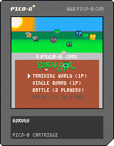

# Genesis

  Eskargool is a game I made during high school to apply what I learned.
  It exist an old **french** version, in swf [here](http://ertel.simon.free.fr/salade/).
  It require the flash player or chrome if you want to play it.

# PICO-8 Eskargool

Game developed on and for PICO-8 platform [PICO-8](https://en.wikipedia.org/wiki/Pico-8).

- [Eskargool code](eskargool.p8)
- [Play Eskargool on pico-8 official website](http://www.lexaloffle.com/bbs/?tid=28195)

## LICENSE

[MIT](https://mit-license.org/)
